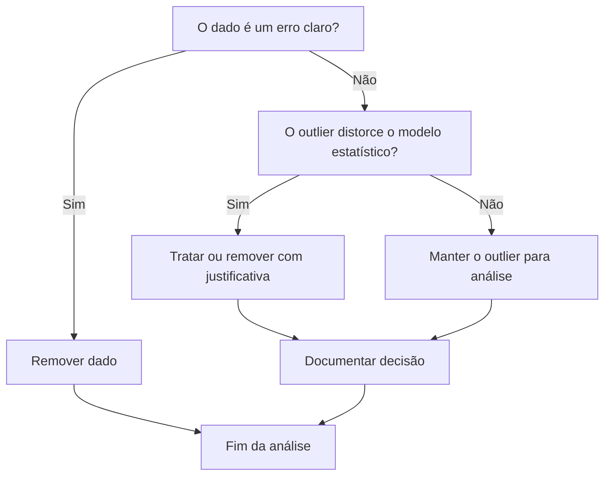

# Outliers
Outliers (ou valores discrepantes) são dados que se distanciam significativamente dos demais pontos de um conjunto.
## Fluxograma: Remover ou não outliers

```mermaid
flowchart TD
    A[O dado é um erro claro?] -->|Sim| B[Remover dado]
    B --> Z[Fim da análise]

    A -->|Não| C[O outlier distorce o modelo estatístico?]

    C -->|Sim| D[Tratar ou remover com justificativa]
    C -->|Não| E[Manter o outlier para análise]

    D --> F[Documentar decisão]
    E --> F
    F --> Z
```

